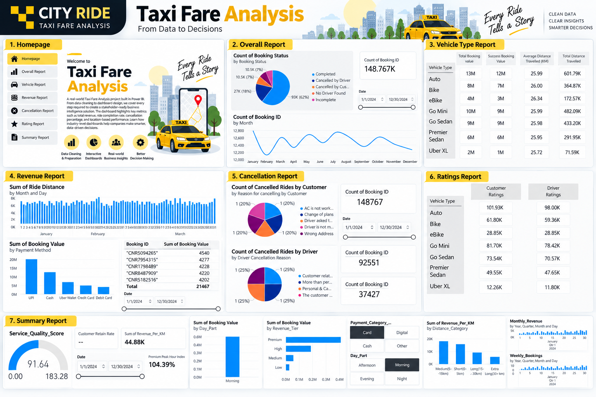

# City Ride - Taxi Fare Analysis

An interactive **Taxi Fare Analysis Dashboard** built in **Microsoft Power BI** to analyze ride bookings, revenue, cancellations, vehicle performance, ratings, and customer behavior.

## Project Overview

This project transforms raw taxi booking data into an interactive Business Intelligence dashboard that helps identify important trends and performance metrics.

## Key Analysis

- Overall booking performance
- Revenue and booking value analysis
- Vehicle type performance
- Cancellation analysis
- Customer and driver ratings
- Customer retention
- Revenue per KM
- Peak-hour performance
- Monthly and weekly booking trends
- Ride distance analysis
- Payment method analysis

## Tools Used

- Power BI
- DAX
- Data Cleaning
- Data Visualization
- Business Intelligence

## Dashboard Pages

1. Homepage
2. Overall Report
3. Vehicle Type Report
4. Revenue Report
5. Cancellation Report
6. Ratings Report
7. Summary Report

## Key DAX Measures

- Customer Retain Rate
- Revenue Momentum
- Weekly Bookings
- Monthly Revenue
- Quarterly Average Booking Value
- Premium Peak Hour Index
- Service Quality Score

## Project Goal

To build a practical, stakeholder-ready Power BI dashboard that converts raw taxi booking data into clear and actionable business insights.

---

**Built with Power BI | DAX | Data Analytics**
